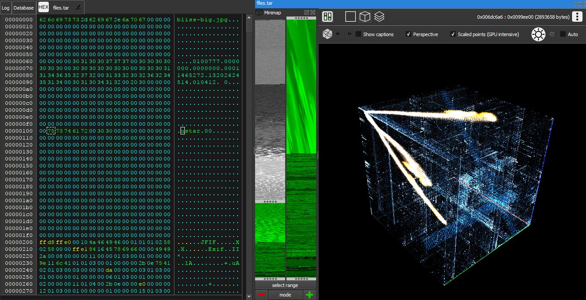

# Veles - A new age tool for binary analysis

It is a very difficult task for a human to notice subtle patterns in large
amounts of binary data, however, us humans are very good at finding patterns in
images. Statistical visualizations let you find the important bits in a sea of
binary data - all at a glance.

See our home page at https://veles.io or visit us on IRC:
[#veles](https://webchat.freenode.net/?channels=#veles) at freenode.

## Binaries

You can download compiled binaries at https://veles.io or
https://github.com/codilime/veles/releases.

## Building

See [BUILDING.md](BUILDING.md) for detailed instructions.

## Contributing

See [CONTRIBUTING.md](CONTRIBUTING.md).
